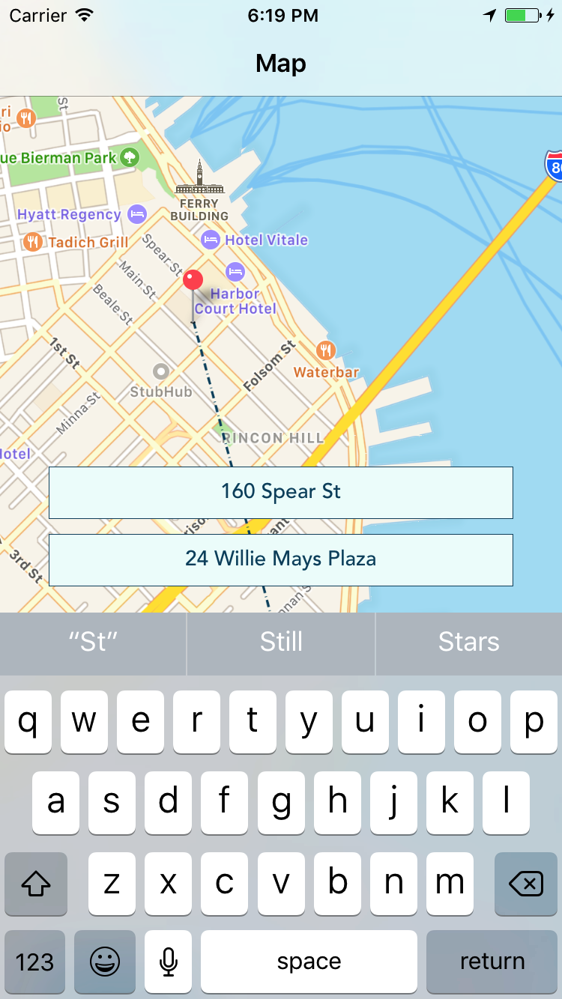
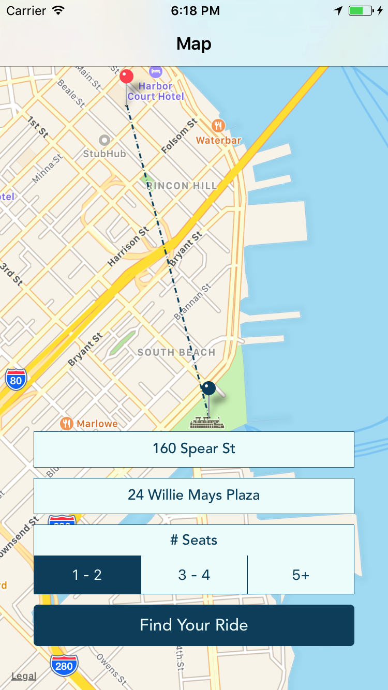
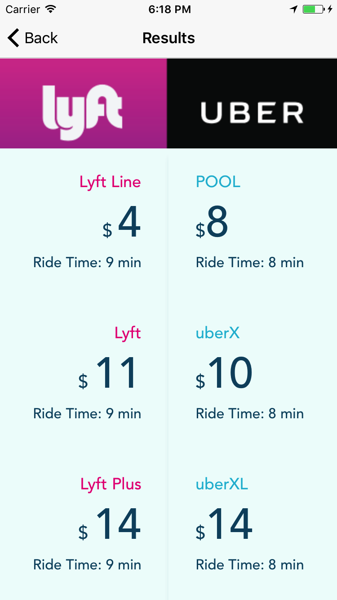

# Lynk

Lynk is a mobile app built using React Native for the Apple iOS platform. By inputting a valid starting point and a destination, it returns a side-by-side comparison of Uber and Lyft prices for different ride types at the time it is requested. Once the ride is selected, users will be redirected to the corresponding ride-sharing app with pre-populated data or the App Store.

For the price conscious, comparing transportation costs between Lyft and Uber requires you to open both apps to check. This app will allow users to do a price comparison from within one single app. Take a look at the demo link below:

[Live Here][live]

<!-- [live]: demo link goes here-->

## Features

* Compare ride costs between Lyft and Uber
* Ability to input address or place name
* Filter ride costs by price and ride time
* Select a ride (Uber or Lyft)
  + Redirect to associated app with pre-populated data
* Centers map view on user's current location
* Pick up location defaults to user's current location

## Code Guide

If you'd like to take a closer look at the code behind the Lynk App, the files are listed below:

* [Form](./components/form.js)
* [Main](./components/main.js)
* [Map Component](./components/map_view_component.js)
* [Data Parsing](./components/data_parser.js)
* [Results](./components/results.js)
* [Ride Results](./components/ride_results.js)
* [Uber List](./components/uber_list.js)
* [Uber Ride Item](./components/uber_ride_item.js)
* [Lyft List](./components/lyft_list.js)
* [Lyft Ride Item](./components/lyft_ride_item.js)

## Languages, Frameworks, Libraries, and APIs

* React
* React-Native
* React-Native-Maps
* React-Native-Geocoding
* JavaScript
* Lyft API
* Uber API
* Google Maps API

## GIFs and Screenshots

Lyft Redirect:

Uber Redirect:

Map Page (Keyboard Avoiding View):

Map Page (Connecting Two Destinations):

Ride Costs Comparison Page:

## Future Implementations
* User login and authorization to persist user account information
* Sidebar for account settings
* Book rides directly through Lynk App
